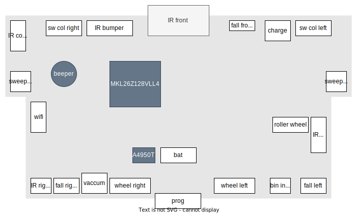

# Introduction
This repo contains information about the Deebot Slim 2 Hardware and Firmware, as well as links to manuals and dumps.

# Overview
## PCB
The graphic below shows the connections of the main PCB



## IC
- Microcontroller: Kinetis MKL26Z128VLL4
- Motor controller: A4950T

# Connectors
For further information of available pin Mux, check
the [reference manual](https://nextcloud.saeber.de/s/ye7Zfg5ae8cNcGc?dir=undefined&path=%2Fprojects%2Fdeebot_mod%2Fdatasheets&openfile=339654) at page 176

## Programming (prog)
The SWD interface is exposed on this connector See gdb
| number | name | description |
| ------ | ---- | ----------- |
|   1    | 3.3V  | 
|   2    | PTA0 | SWD_CLK     |
|   3    | PTA1 | UART0_RX    |
|   4    | PTA2 | UART0_TX    |
|   5    | PTA3 | SWD_IO      |
|   6    | GND  |             |

## Wheel
**Pin 1-2**: Connected to the motor controller. The second name entry shows the connected input pins of the microcontroller

**Pin 3-5**: Impulse speed sensor

**Pin 6-7**: Switch to detect if the wheel is touching the floor 

### right

| number | name      | description          |
| ------ | --------- | -------------------- |
|   1    | OUT1/PTD3 | motor A              |
|   2    | OUT2/PTD2 | motor  B             |
|   3    | 5V - 750R | impulse sensor LED   |
|   4    | PTD6      | impulse sensor SENSE |
|   5    | GND       | impulse sensor GND   |
|   6    | PTE25     | switch               |
|   7    | GND       | switch               |

### left

| number | name      | description          |
| ------ | --------- | -------------------- |
|   1    | OUT1/PTD0 | motor A              |
|   2    | OUT2/PTD1 | motor  B             |
|   3    | 5V - 750R | impulse sensor LED   |
|   4    | PTD7      | impulse sensor SENSE |
|   5    | GND       | impulse sensor GND   |
|   6    | PTE3      | switch               |
|   7    | GND       | switch               |

# Firmware dump
**Warning**: The firmware dump was created by reading out the memory mapped flash according to the datasheet. It is possible, that security measurements where active on the mcirocontroller to prevent a flash memory dump. Nevertheless, here it is:

[Original Firmware Dump](https://nextcloud.saeber.de/s/ye7Zfg5ae8cNcGc/download?path=%2Fprojects%2Fdeebot_mod%2Ffirmware&files=deebot_slim_2_firmware_dump.bin&downloadStartSecret=tk08qtidq38)

# Connecting via SWD
Under Ubuntu 21.04 install the latest release of
- openocd
- gdb-multiarch

I used an *ST-Link v2* clone to connect to the SWD interface exposed at the prog connector.
With **openOCD** installed, open a terminal windoe and run the command:
```
openocd -f interface/stlink.cfg  -f target/klx.cfg  
```

In a second terminal window run **gdb**
```
gdb-multiarch
```

followed by
```
tar ext localhost:3333
```

With this, a debug connection should be established. From here, firmware dumps, register readout and manipulation are possible.
